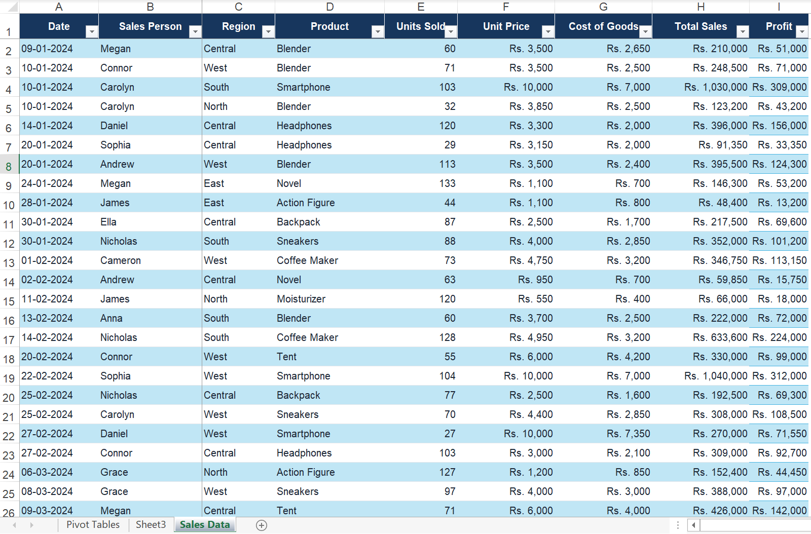
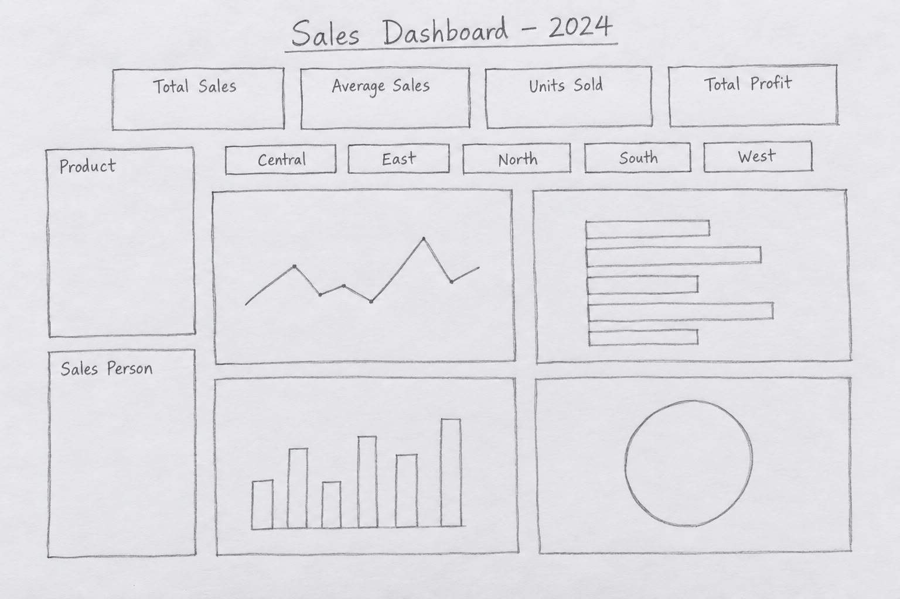

📊 Sales Dashboard – 2024

Interactive Sales Analysis Using Microsoft Excel

An interactive Excel dashboard created using 300 sample sales records to display key performance indicators, product trends, regional performance, salesperson results, and overall profitability through charts and slicers.

 
 

⸻

📌 Project Overview

This project demonstrates how Microsoft Excel can be used to transform a structured sales dataset into an interactive and visually clear business dashboard.

The project was created using 300 sample sales records containing information about transaction dates, salespeople, regions, products, units sold, unit prices, costs, and total sales.

Excel Tables, formulas, PivotTables, PivotCharts, and slicers were used to analyse the data and present the results in a one-page dashboard.

⸻

📈 Final Sales Dashboard

The completed dashboard presents the main sales results using KPI cards, charts, and interactive slicers.

Users can filter the dashboard by product, salesperson, and region to analyse specific areas of sales performance.

  

⸻

🗂️ Source Data

The source dataset contains 300 sample sales transactions used to create the calculations, PivotTables, PivotCharts, and dashboard.

  

Dataset Fields

Field	Description
Date	Date of the sales transaction
Sales Person	Employee responsible for the sale
Region	Region where the transaction occurred
Product	Name of the product sold
Units Sold	Number of product units sold
Unit Price	Selling price of one unit
Cost of Goods	Cost associated with one product unit
Total Sales	Total revenue generated by the transaction

⸻

✏️ Dashboard Sketch

Before creating the final Excel dashboard, a simple sketch was prepared to plan the positions of the KPI cards, slicers, and charts.

The sketch helped organise the layout and provided a clear structure for developing the final dashboard.

  

Important: The image filename in the repository must be exactly Dashboard-Scratch.jpeg. GitHub filenames and extensions are case-sensitive.

⸻

🎯 Key Performance Indicators

KPI	Result
💰 Total Sales	Rs. 85,725,800
📊 Average Sales	Rs. 285,752.67
📦 Units Sold	23,933
📈 Total Profit	Rs. 26,296,950

⸻

⚙️ Dashboard Features

Interactive Slicers

* Product Slicer: Filters dashboard results by product.
* Salesperson Slicer: Displays results for the selected salesperson.
* Region Slicer: Compares Central, East, North, South, and West.

Dashboard Visualisations

* Line chart showing units sold by product
* Horizontal bar chart comparing units sold by product
* Column chart showing total sales by salesperson
* Doughnut chart showing total sales by region

Interactive Analysis

All charts are connected to slicers. When a slicer option is selected, the related KPI cards, PivotTables, and PivotCharts update automatically.

⸻

🧮 Calculations

Total Sales

Total Sales = Units Sold × Unit Price

Total Profit

Total Profit = (Unit Price − Cost of Goods) × Units Sold

Average Sales

Average Sales = Total Sales ÷ Number of Transactions

⸻

🛠️ Tools and Techniques

* Microsoft Excel
* Excel Tables
* Excel formulas
* PivotTables
* PivotCharts
* Interactive slicers
* Conditional formatting
* Dashboard layout and design
* Sales data analysis

⸻

🔄 Project Workflow

flowchart LR
    A[Sales Data] --> B[Data Preparation]
    B --> C[Calculations]
    C --> D[PivotTables]
    D --> E[PivotCharts]
    E --> F[Excel Dashboard]

Development Process

1. Created and formatted the 300-record sales dataset.
2. Checked the dataset for missing information and calculation errors.
3. Calculated total sales, profit, and average sales.
4. Created PivotTables to summarise sales performance.
5. Created PivotCharts from the PivotTable results.
6. Added product, salesperson, and region slicers.
7. Designed KPI cards for the main performance indicators.
8. Organised the dashboard into a clear one-page layout.
9. Tested all slicers, calculations, and charts.

⸻

📁 Project Files

File	Description
Sales Dashboard 2024.xlsx	Completed interactive Excel dashboard
Sales Dashboard 2024.png	Final dashboard preview
Dashboard-Scratch.jpeg	Initial dashboard layout sketch
Data.png	Source dataset preview
README.md	Project documentation

⸻

⬇️ Download and Use

Download the Excel Dashboard

Download the Complete Repository

1. Click the green Code button.
2. Select Download ZIP.
3. Extract the downloaded ZIP folder.
4. Open Sales Dashboard 2024.xlsx using Microsoft Excel.
5. Enable editing if Excel opens the file in protected view.
6. Use the slicers to filter results by product, salesperson, or region.

Microsoft Excel desktop is recommended for the best interactive experience.

⸻

💡 Skills Demonstrated

* Data preparation and cleaning
* Excel formula development
* Sales data analysis
* PivotTable creation
* PivotChart development
* Interactive slicer configuration
* KPI calculation
* Dashboard planning
* Dashboard design
* Business data visualisation

⸻

👤 Author

Ahmed Raazim

Excel Dashboard and Data Analysis Project

⸻

Thank You for Viewing This Project

⭐ If you found this project useful, consider giving the repository a star.

Back to Top

